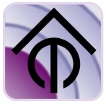

# ioBroker.rfmapper

## rfmapper adapter für ioBroker

Der RfMapper stellt eine unbeschränkte Verknüpfung von 433MHz-Geräten über eine SonOff RF Bridge mit Tasmota Firmware bereit. Die Geräte werden direkt im IOBroker erstellt und verwaltet und müssen daher nicht in der Bridge registriert werden.

## Configuration

Zunächst müssen die Verbindungsdaten zum MQTT-Server eingetragen werden.

##### Status-Topic

Für den Status-Topic wird der Topic der MQTT-Nachricht hinterlegt, unter welcher die empfangenen RF-Codes der Bridge übermittelt werden.

Die Nachricht sollte mindestens folgenden Payload besitzen:

{"RfReceived":{"Data":"XXXXXXX"}}

##### Command-Topic

Der Command-Topic wird genutzt um die entsprechenden Ein- bzw. Ausschlatcodes an die Bridge zu senden.

Beim Betrieb mehrere Bridges wird empfohlen, nicht den gemeinsamen Group-Topic aller Bridges zu nutzen, sondern jeden spezifischen Geräte-Topic mit einem Semikolon getrennt anzugeben.

Dadurch werden die Befehle von jeder Bridge nacheinander gesendet.

Das Zeitgleiche Senden der Befehle führt zu Interferenzen und zu deutlichen Instabilitäten.

Der Delay sollte auch für diesen Fall nicht zu gering gewählt werden.

Für den Delay-Konfigurationspunkt der RF Settings kann das Delay zwischen MQTT-Commands verändert werden.

Dieses ist notwendig, damit sich Schaltbefehlt bei Zeitgleich veränderten Objekten nicht überlagern, oder so schnell an die Bridge gesendet werden, dass diese Befehle verschluckt.

## Devices

Über den Tab Devices können Geräte hinzugefügt werden um diese als Objekte schalten zu können.

##### ID
Eindeutige ID des Gerätes. Biem Neuanlegen repräsentiert dies ebenfalls die ObjectID und kann nachträglich nicht verändert werden, bzw. führt zur Neuanlage mit der entsprechenden ID.

##### Name
Ein Name bzw. Beschreibung des Gerätes. Dient nur zur besseren Identifikation innerhalb dieser View.

##### Condition ID
In der Condition ID kann eine ObjectID hinterlegt werden, dessen State auf true stehen muss, damit das  Object bei eigehendem Signal auch wirklich geschaltet wird. Dies ist z.Bsp. sinnvoll um einen Bewegungsmelder nur dann zu Triggern, wenn z.Bsp. die ObjectID den Sonnenuntergang darstellt.  

##### CodeOn / CodeOff
Der entsprechende Ein- bzw. Ausschaltcode des Gerätes. 

#####  Timer in sec
Speziell für Bewegungsmelder, oder Taster, die i.d.R. nur über einen "Einschalt-" Code verfügen, kann in dieser Spalte eine Zeitspanne in Sekunden angegeben werden, ab wann sich das Objekt wieder auf "false" schalten soll.
###### Timerreset
Sollte das Gerät während der Timer-Zeit erneut Signale senden, beginnt der Timer von vorn.

## Objekte
##### Last incoming Code
Über das Objekt "Last incoming code" kann jederzeit das aktuell empfangene Signal ermittelt werden.
Einige Funkfernbedienungen senden in einem Schaltprozess oft ein "Schlusssignal", welches dann Final durch die RFBridge dargestellt wird.
Das führt dazu, dass das eigentliche Ein-/Ausschaltsignal nicht angezeigt wird.
Daher empfehle ich zum Sniffen der Signale die Verwendung eines extra 433 Empfängers und den 433Utils, da diese deutlich mehr empfangene Signale protokollieren und man so leichter das richtige Schaltsignal ermitteln kann.
Um die Signale bei der Verwendung der 433Utils einfacher übertragen zu können empfehle ich ebenfalls, den Betrieb der Tasmota SonOFF Bridge in den Dezimalbetrieb (SetOption28 1) umszustellen.
Sollte der Hexadezimale Betrieb gewünscht sein, muss der Code mit einer # vorangestellt werden.

##### Geräte
Unter dem Verzeichnis der Objekte werden alle in der Konfiguration erzeugten Geräte  beim Speichern angelegt.

## Changelog

### 0.0.1
* (Author) initial release

## License
MIT License

Copyright (c) 2020 Christian Tügel <info@ctcomputertechnik.de>

Permission is hereby granted, free of charge, to any person obtaining a copy
of this software and associated documentation files (the "Software"), to deal
in the Software without restriction, including without limitation the rights
to use, copy, modify, merge, publish, distribute, sublicense, and/or sell
copies of the Software, and to permit persons to whom the Software is
furnished to do so, subject to the following conditions:

The above copyright notice and this permission notice shall be included in all
copies or substantial portions of the Software.

THE SOFTWARE IS PROVIDED "AS IS", WITHOUT WARRANTY OF ANY KIND, EXPRESS OR
IMPLIED, INCLUDING BUT NOT LIMITED TO THE WARRANTIES OF MERCHANTABILITY,
FITNESS FOR A PARTICULAR PURPOSE AND NONINFRINGEMENT. IN NO EVENT SHALL THE
AUTHORS OR COPYRIGHT HOLDERS BE LIABLE FOR ANY CLAIM, DAMAGES OR OTHER
LIABILITY, WHETHER IN AN ACTION OF CONTRACT, TORT OR OTHERWISE, ARISING FROM,
OUT OF OR IN CONNECTION WITH THE SOFTWARE OR THE USE OR OTHER DEALINGS IN THE
SOFTWARE.